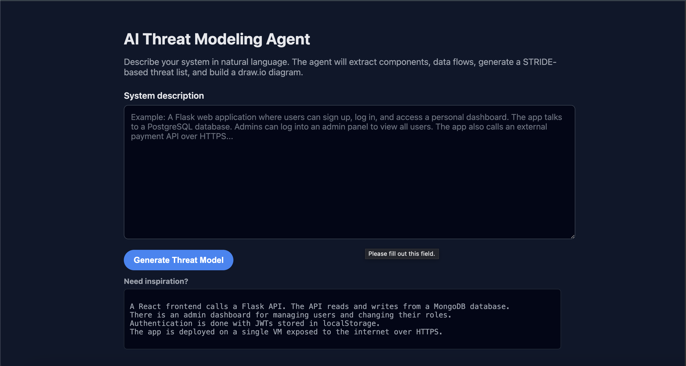
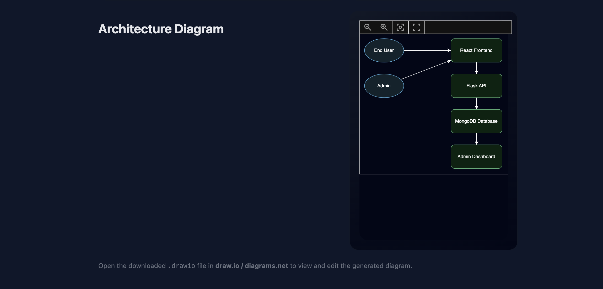

# Agentic AI Project: AI Threat Modeling Agent
### CSC 180: Intro to Intelligent Systems





This project is a small **agentic AI** web app that turns a natural-language system description into:
- a list of **actors**, **components**, and **data flows**
- a set of **STRIDE threats** (Spoofing, Tampering, Repudiation, Information Disclosure, DoS, Elevation of Privilege)
- an auto-generated **.drawio diagram** you can open in draw.io / diagrams.net.

Built with **Python, Flask, OpenAI (ChatGPT), and a custom draw.io XML generator**.

---

## How it works (Agentic Workflow)

1. **User input** – you type a plain-English description of your system.
2. **LLM parsing** – the app calls ChatGPT to extract:
   - `actors`
   - `components`
   - `flows`
3. **LLM threat generation** – ChatGPT is called again to generate STRIDE threats for each component.  
   If JSON parsing fails, a simple rule-based STRIDE generator is used as a fallback.
4. **Tool use** – Python code calls a diagram generator that creates a `.drawio` file from actors/components/flows.
5. **Flask output** – results are shown in the browser and the `.drawio` diagram can be downloaded.

---

## Project structure

- `app.py` – Flask app (routes: `/`, `/generate`, `/download`)
- `agent/orchestrator.py` – main agent logic (ChatGPT calls + orchestration)
- `agent/diagram_generator.py` – builds the `.drawio` XML diagram
- `templates/index.html` – input form
- `templates/results.html` – results page
- `outputs/diagram.drawio` – last generated diagram

--- 

## Setup

1. Create and activate a virtual environment:

   ```bash
   python3 -m venv venv
   source venv/bin/activate
   ```

2. Install dependencies:
    ```bash
    pip install -r requirements.txt
    ```
3. Create a .env file in the project root and add your OpenAI key:
    ```bash 
    API_KEY=sk-...your-key-here...
    ```

---

## Run the APP
```bash 
python3 app.py 
```

- Open http://127.0.0.1:5000 in your browser.

- Enter a system description

- Click Generate Threat Model

- Review actors, components, flows, and STRIDE threats

- Click Download draw.io diagram to open the architecture in draw.io

--- 

## Example Prompt to Test
```bash 
A React frontend talks to a Node/Express backend over JSON APIs.
The backend uses MongoDB Atlas to store user data.
Admins log into an admin portal to manage users and reset passwords.
```
This should produce:

- Actors: end-users, admins

- Components: React frontend, Node/Express backend, MongoDB Atlas, admin portal

- Flows + a list of STRIDE threats + a diagram.
